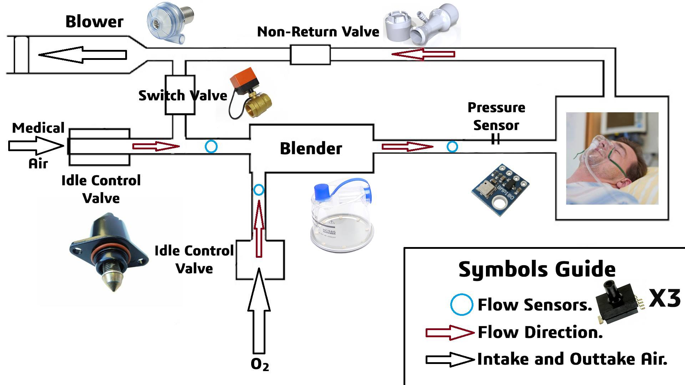

# EEV20.1 – Emergency Electronic Ventilator

<p align="center">
  
</p>

<p align="center">
  
  
  
  
</p>
</p>

---

## 📌 Overview

**EEV20.1** is an **Emergency Electronic Ventilator prototype** developed as an open-source engineering project.  
The goal of this project is to demonstrate a **complete ventilator system design**, including:

- Mechanical structure
- Pneumatic system
- Embedded firmware
- Control logic
- Documentation & 3D visualization

> ⚠️ **Disclaimer:**  
> This project is intended **for educational, research, and prototyping purposes only**.  
> It is **NOT a certified medical device** and must not be used for real patients without proper medical approvals.

---

## 🎥 3D Model Preview

The following GIF shows the **actual 3D model** included in this repository:

<p align="center">
  
</p>

The original 3D assets are available in **GLB format** inside the `docs/` directory.

---
🖼️ Circuit Diagram
<p align="center">

*Figure 2: Pneumatic schematic showing flow paths and control valves.*

### 🔍 Operational Principle / فكرة العمل

* **Mixing Phase (مرحلة الخلط):** Controlled by stepper motors, the Air and $O_2$ valves open to a specific ratio to achieve the target $FiO_2$.
* **Delivery Phase (مرحلة الضخ):** The mixture is pressurized and delivered to the patient through a regulated flow path.
* **Exhalation (الزفير):** The system manages the exhalation valve to maintain **PEEP** (Positive End-Expiratory Pressure) if required.

---

## 📂 Repository Structure / هيكل المشروع

```text
EEV20.1/
├── .gitattributes                       # Git configuration for line endings, etc.
├── LICENSE                              # MIT License file
├── bill of materials.docx                # Complete parts list for the ventilator
├── EEV 20 ventilator User manual.pdf    # Main user manual PDF
├── Product_vision.gif                    # GIF preview of the 3D model
├── Pneumatic_circuit.jpg                 # Pneumatic system diagram
├── README.md                             # This file
├── docs/                                 # 3D models & viewer assets
│   ├── Body Design Containing Control Components.SLDPRT  # Solidworks CAD file of main enclosure & control
│   ├── index.html                        # Web page for 3D model viewing
│   ├── PCBs_Schematics.pdf               # PDF of PCB schematics
│   ├── Product_vision.glb                # 3D model of final product (GLB format)
│   ├── Product_vision.mp4                # Video render of the product
│   ├── Prototype.glb                     # 3D model of prototype version
│   └── Prototype.mp4                     # Video render of prototype
├── Render Prev images/                    # Screenshots & renders of components
│   ├── 2 Idle Valves.PNG
│   ├── Blower.PNG
│   ├── Design.PNG
│   ├── Humidifier.PNG
│   ├── keypad.PNG
│   ├── LCD.PNG
│   └── non return valve.PNG
└── Ventilation_Firmware_ATmega128A/      # Embedded firmware for ATmega128A
    ├── README.md                         # Firmware-specific README with build instructions
    ├── main.c                            # Main program entry point
    ├── app/                              # Application-level logic
    │   ├── ventilation_fsm.c             # Finite State Machine implementation
    │   └── ventilation_fsm.h             # FSM header
    ├── config/                           # Configuration files
    │   └── ventilation_config.h          # Configurable parameters for firmware
    ├── control/                          # Control modules
    │   ├── ventilation_idle_stepper_control.c  # Idle stepper motor control logic
    │   └── ventilation_idle_stepper_control.h  # Header for stepper control
    ├── drivers/                          # Low-level hardware drivers
    │   ├── lcd_driver.c                  # LCD screen driver
    │   ├── lcd_driver.h                  # LCD driver header
    │   ├── stepper_driver.c              # Stepper motor driver
    │   └── stepper_driver.h              # Stepper driver header
    ├── logic/                             # Computational logic modules
    │   ├── ventilation_machine_calculations.c   # Core ventilation calculations
    │   └── ventilation_machine_calculations.h   # Header for calculations
    ├── safety/                            # Safety and alarms
    │   ├── ventilation_safety.c          # Safety functions (limits, alarms)
    │   └── ventilation_safety.h          # Header for safety functions
    ├── ui/                                # User interface modules
    │   ├── ventilation_lcd.c             # LCD interface code
    │   └── ventilation_lcd.h             # LCD interface header
    └── v3_old/                            # Previous versions / prototypes
        ├── Air_flow_sensors_V1/          # Air flow sensor firmware
        │   ├── Air_Flow_Sensors_V1.cpp
        │   ├── Air_Flow_Sensors_V1.h
        │   └── Air_flow_sensors_V1.ino
        ├── mqtt_ventilation_machine_V1/  # MQTT-enabled prototype
        │   ├── ESP8266_MQTT_Client_V1.cpp
        │   ├── ESP8266_MQTT_Client_V1.h
        │   └── ESP8266_MQTT_Client_V1.ino
        ├── ventilation_control_pad_V2/   # Control pad prototype V2
        │   ├── ventilation_control_pad_V2.cpp
        │   ├── ventilation_control_pad_V2.h
        │   └── ventilation_control_pad_V2.ino
        ├── ventilation_idle_stepper_control/  # Old idle stepper control
        │   ├── ventilation_idle_stepper_control.cpp
        │   ├── ventilation_idle_stepper_control.h
        │   └── ventilation_idle_stepper_control.ino
        ├── ventilation_lcd_V3/            # Old LCD V3 code
        │   ├── ventilation_lcd_V3.cpp
        │   ├── ventilation_lcd_V3.h
        │   └── ventilation_lcd_V3.ino
        └── ventilation_machine_calculations/  # Old calculation modules
            ├── ventilation_machine_calculations.cpp
            ├── ventilation_machine_calculations.h
            └── ventilation_machine_calculations.ino
                          # Main project readme
```

## 🛠 System Components

### 🔌 Embedded System
- **Microcontroller:** ATmega128A
- **Language:** C (Bare-metal / AVR)
- **Architecture:** Modular & layered
- **Purpose:** Motor control, timing, safety logic, system states

### 🫁 Pneumatic System
- Pressure control
- Air flow regulation
- Safety relief mechanisms  
(see `Pneumatic_circuit.jpg`)

### 🧱 Mechanical Design
- Custom enclosure
- Motor-driven compression mechanism
- Designed for manufacturability & prototyping

---

## 📘 Documentation

Available documents include:

- **User Manual**
- **Pneumatic Circuit Diagram**
- **PCB & Electrical Schematics**
- **Project Reports & Presentations**

All documents are available directly in the repository as PDFs or inside the `Documentation/` folder.

---

## 💻 Firmware

The firmware source code is located in:

Ventilation_Firmware_ATmega128A/

yaml
Copy code

It includes:
- Low-level drivers
- Control logic
- Timing & safety handling
- Modular structure suitable for extension

📄 Please refer to the **README inside the firmware folder** for:
- Build instructions
- Code architecture
- Configuration details

---

## ⚠️ Safety Notice

- ❌ Not FDA / CE approved  
- ❌ Not clinically tested  
- ❌ Not intended for real medical use  

This project is shared **for learning and engineering demonstration only**.

---

## 📜 License

This project is licensed under the **MIT License**.

MIT License

Copyright (c) 2025 Abdelrahman Elnahrawy

Permission is hereby granted, free of charge, to any person obtaining a copy
of this software and associated documentation files...

yaml
Copy code

---

## 👤 Author

**Abdelrahman Elnahrawy**  
Embedded Systems & Mechatronics Engineer  

🔗 GitHub:  
https://github.com/Abdelrahman-Elnahrawy

---

## ⭐ Acknowledgment

If this project helped you learn or inspired your work, consider starring the repository ⭐  
and sharing it with the engineering community.
